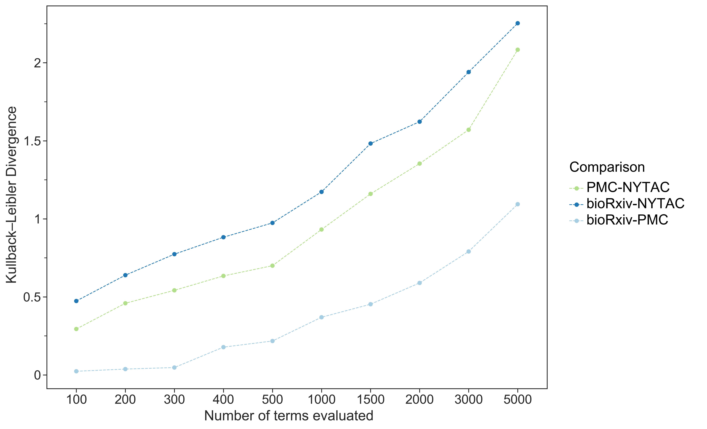
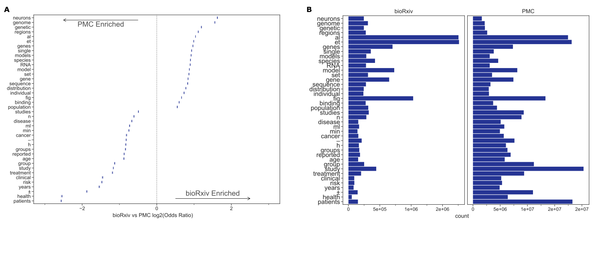
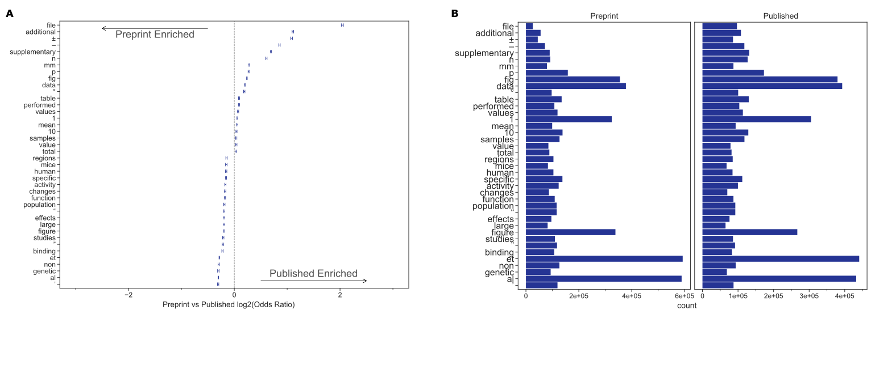
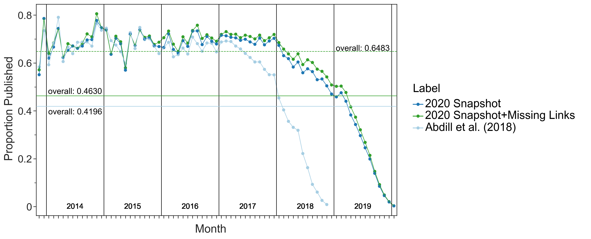
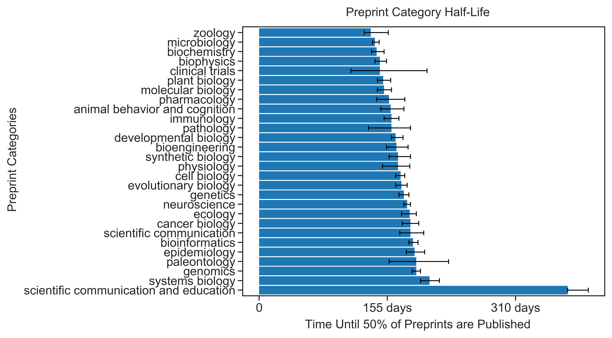
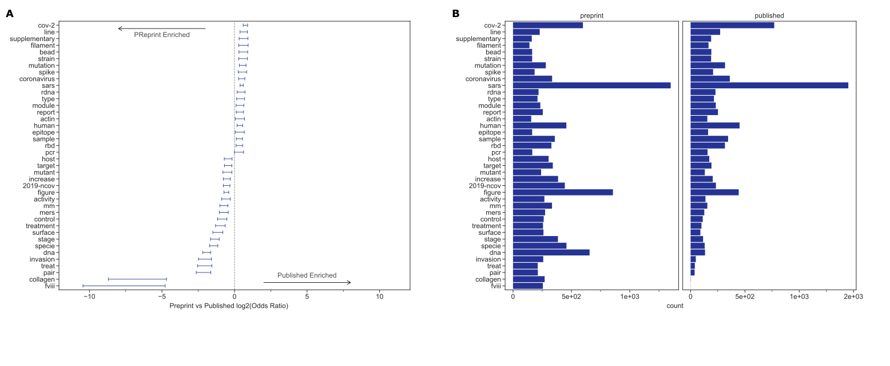

# Figure Data Map

## About
This file is designed to point users and readers to datasets that were used to generate each figure piece.
Each figure heading will have a table that specifies the following information: 
- the panel piece label
- it's corresponding dataset file
- the name of the notebook that generated each panel piece

## Figure One

| Panel | Img Preview | Dataset | Notebook |
| ----- | ----------- | ------- | ------------------------ |
| Fig. 1A |  | [biorxiv/corpora_comparison/output/comparison_stats/corpora_kl_divergence.tsv](biorxiv/corpora_comparison/output/comparison_stats/corpora_kl_divergence.tsv) | [biorxiv/corpora_comparison/05_figure_generator_reviewer_request.ipynb](https://github.com/danich1/annorxiver/blob/master/biorxiv/corpora_comparison/05_figure_generator_reviewer_request.ipynb) |
| Fig. 1B (A in preview, B in manuscript) |  | [biorxiv/corpora_comparison/output/comparison_stats/biorxiv_vs_pmc_comparison_error_bars.tsv](biorxiv/corpora_comparison/output/comparison_stats/biorxiv_vs_pmc_comparison_error_bars.tsv) |  [biorxiv/corpora_comparison/05_figure_generator_reviewer_request.ipynb](https://github.com/danich1/annorxiver/blob/master/biorxiv/corpora_comparison/05_figure_generator_reviewer_request.ipynb) |
| Fig. 1C (B in preview, C in manuscript) |  | [biorxiv/corpora_comparison/output/comparison_stats/biorxiv_vs_pmc_comparison_raw_counts.tsv](biorxiv/corpora_comparison/output/comparison_stats/biorxiv_vs_pmc_comparison_raw_counts.tsv) |  [biorxiv/corpora_comparison/05_figure_generator_reviewer_request.ipynb](https://github.com/danich1/annorxiver/blob/master/biorxiv/corpora_comparison/05_figure_generator_reviewer_request.ipynb) |
| Fig. 1D (A in preview, D in manuscript) |  | [biorxiv/corpora_comparison/output/comparison_stats/preprint_to_published_comparison_error_bars.tsv](biorxiv/corpora_comparison/output/comparison_stats/preprint_to_published_comparison_error_bars.tsv) |  [biorxiv/corpora_comparison/05_figure_generator_reviewer_request.ipynb](https://github.com/danich1/annorxiver/blob/master/biorxiv/corpora_comparison/05_figure_generator_reviewer_request.ipynb) |
| Fig. 1E (B in preview, E in manuscript) |  | [biorxiv/corpora_comparison/output/comparison_stats/preprint_to_published_comparison_raw_counts.tsv](biorxiv/corpora_comparison/output/comparison_stats/preprint_to_published_comparison_raw_counts.tsv) |  [biorxiv/corpora_comparison/05_figure_generator_reviewer_request.ipynb](https://github.com/danich1/annorxiver/blob/master/biorxiv/corpora_comparison/05_figure_generator_reviewer_request.ipynb) |

## Figure Two

| Panel | Img Preview | Dataset | Notebook |
| ----- | ----------- | ------- | ------------------------ |
| Fig. 2A |  | [biorxiv/article_distances/output/annotated_links/article_distances.tsv](biorxiv/article_distances/output/annotated_links/article_distances.tsv) |  [biorxiv/article_distances/01_biorxiv_article_distances.ipynb](biorxiv/article_distances/01_biorxiv_article_distances.ipynb) |
| Fig. 2B |  | [biorxiv/article_distances/output/annotated_links/article_distances.tsv](biorxiv/article_distances/output/annotated_links/article_distances.tsv) |  [biorxiv/article_distances/01_biorxiv_article_distances.ipynb](biorxiv/article_distances/02_biorxiv_article_distance_evaluation.ipynb) |
| Fig. 2C |  | [biorxiv/article_distances/output/annotated_links/article_distances.tsv](biorxiv/article_distances/output/adjusted_publication_rate.tsv) |  [biorxiv/article_distances/03_biorxiv_corrected_published_rate.ipynb](biorxiv/article_distances/03_biorxiv_corrected_published_rate.ipynb) |

## Figure Three
| Panel | Img Preview | Dataset | Notebook |
| ----- | ----------- | ------- | ------------------------ |
| Fig. 3A |  | [biorxiv/article_distances/output/annotated_links/article_distances.tsv](biorxiv/time_to_publication/output/preprint_category_halflife_numbers.tsv) |  [biorxiv/time_to_publication/time_to_published_refurbished.ipynb](biorxiv/time_to_publication/time_to_published_refurbished.ipynb) |
| Fig. 3B |  | [biorxiv/publication_delay_experiment/output/preprint_published_distances.tsv](biorxiv/publication_delay_experiment/output/preprint_published_distances.tsv) |  [biorxiv/publication_delay_experiment/02_publication_delay_experiment_figure_exploration.ipynb](biorxiv/publication_delay_experiment/02_publication_delay_experiment_figure_exploration.ipynb) |
| Fig. 3C |  | [biorxiv/publication_delay_experiment/output/preprint_published_distances.tsv](biorxiv/publication_delay_experiment/output/preprint_published_distances.tsv) |  [biorxiv/publication_delay_experiment/02_publication_delay_experiment_figure_exploration.ipynb](biorxiv/publication_delay_experiment/02_publication_delay_experiment_figure_exploration.ipynb) |

## Figure Five
| Panel | Img Preview | Dataset | Notebook |
| ----- | ----------- | ------- | ------------------------ |
| Fig. 5A |  | [biorxiv/polka_subset_experiment/output/polka_preprint_published_comparison_error_bars.tsv](biorxiv/polka_subset_experiment/output/polka_preprint_published_comparison_error_bars.tsv) | [biorxiv/polka_subset_experiment/03_rerun_analyses_with_added_subset.ipynb](biorxiv/polka_subset_experiment/03_rerun_analyses_with_added_subset.ipynb) |
| Fig. 5B |  | [biorxiv/polka_subset_experiment/output/polka_preprint_published_comparison_raw_counts.tsv](biorxiv/polka_subset_experiment/polka_preprint_published_comparison_raw_counts.tsv) |  [biorxiv/polka_subset_experiment/03_rerun_analyses_with_added_subset.ipynb](biorxiv/polka_subset_experiment/03_rerun_analyses_with_added_subset.ipynb) |
| Fig. 5C |  | [biorxiv/polka_subset_experiment/output/polka_et_al_saucie_coordinates.tsv](biorxiv/polka_subset_experiment/output/polka_et_al_saucie_coordinates.tsv), [pmc/journal_recommendation/output/paper_dataset/paper_dataset_full_tsne.tsv](pmc/journal_recommendation/output/paper_dataset/paper_dataset_full_tsne.tsv) | [biorxiv/polka_subset_experiment/03_rerun_analyses_with_added_subset.ipynb](biorxiv/polka_subset_experiment/03_rerun_analyses_with_added_subset.ipynb), [biorxiv/polka_subset_experiment/saucie_plot.R](biorxiv/polka_subset_experiment/saucie_plot.R) |
| Fig. 5D |  | [biorxiv/polka_subset_experiment/output/polka_preprint_published_distances.tsv](biorxiv/polka_subset_experiment/output/polka_preprint_published_distances.tsv), [biorxiv/publication_delay_experiment/output/preprint_published_distances.tsv](biorxiv/publication_delay_experiment/output/preprint_published_distances.tsv) |  [biorxiv/polka_subset_experiment/03_rerun_analyses_with_added_subset.ipynb](biorxiv/polka_subset_experiment/03_rerun_analyses_with_added_subset.ipynb) |
| Fig. 5E |  | [biorxiv/polka_subset_experiment/output/polka_preprint_published_distances.tsv](biorxiv/polka_subset_experiment/output/polka_preprint_published_distances.tsv), [biorxiv/publication_delay_experiment/output/preprint_published_distances.tsv](biorxiv/publication_delay_experiment/output/preprint_published_distances.tsv) |  [biorxiv/polka_subset_experiment/03_rerun_analyses_with_added_subset.ipynb](biorxiv/polka_subset_experiment/03_rerun_analyses_with_added_subset.ipynb) |
